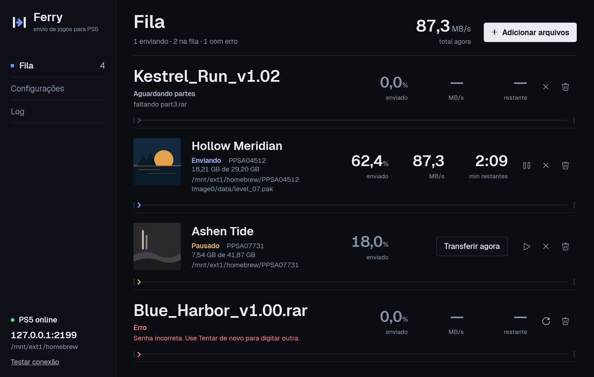

 

# Ferry

**English** · [Português (BR)](README.pt-BR.md) · [Español](README.es.md)

send games to your PS5



[](https://github.com/bps2414/ferry/actions/workflows/ci.yml)

Ferry takes compressed games (`.zip`, `.rar`, `.7z`, including multi-part archives) and **extracts and uploads them at the same time** to a jailbroken PS5 over FTP — the extracted files are never written to your disk.

- **Windows**: a portable `.exe` (nothing to install)
- **Self-hosted** (Docker or Linux): runs on your home server and you use it from the browser at `http://<server-ip>:8021`
- Dark interface with queue, progress, speed and time remaining
- Pause, resume, close and reopen without losing what was already sent

The web interface supports Portuguese (Brazil) and English. In **Settings → Language**, choose **Automatic**, **Português (Brasil)** or **English**. Automatic uses the browser's first supported language and falls back to English. An explicit choice is saved for the installation, including login, and survives a restart. The Windows WPF interface remains in Portuguese.

> Made for your own homebrew/backups on an unlocked console. Use at your own risk.

## Download

Get `Ferry.exe` from the [Releases](../../releases) page and run it. Requires Windows 10/11 x64.

## Self-hosted (home server)

The same engine as the Windows app, with a web interface: live queue, settings, log, archive password asked in the browser, and uploads by dragging files onto the page (in chunks — it resumes where it stopped if the connection drops).

**Docker** (amd64 and arm64): copy [`docker-compose.yml`](docker-compose.yml), replace `/caminho/dos/jogos` with your games folder and run:

```bash
docker compose up -d
```

Open `http://<server-ip>:8021`. On first open the page asks you to create a user and password. Image: `ghcr.io/bps2414/ferry`.

- `network_mode: host` is recommended: PS5 discovery scans your home network and FTP to the PS5 works without NAT.
- Volumes: `/data` (settings, queue, log, login) and `/games` (watched folder: anything dropped there is queued automatically; browser uploads go there too).
- Variables: `FERRY_PORT` (default `8021`), `FERRY_DATA` (`/data`), `FERRY_GAMES` (`/games`).
- Forgot the password: delete `auth.json` in the data folder and open the page again.

**Linux without Docker** (x64 or arm64, e.g. Raspberry Pi): download `Ferry-linux-x64.tar.gz` (or `-arm64`) from [Releases](../../releases), extract it and run `./ferry`. 7-Zip is included in the package. Data goes to `~/.local/share/Ferry` (or `FERRY_DATA`).

> Without https the browser won't let the page show system notifications; notices (finished, error, password) appear inside the page. For access from outside your home, use a reverse proxy with https or a VPN — don't expose the port directly to the internet.

## How to use

1. Run an FTP payload on the PS5 (**ftpsrv**, port 2121, or **etaHEN**'s FTP, port 1337).
2. Open **Settings**: PS5 IP, port, destination (**M.2** `/mnt/ext1/homebrew` or **internal SSD** `/data/homebrew`). Everything saves automatically. The bottom of the sidebar shows whether the PS5 is online.
3. In **Queue**, click the middle of the screen (opens the file picker) or drag the files onto the window. Select **all parts** at once.
4. Done: once every part is present, the game is extracted and sent to `<destination>/<game folder>`.

Optional: a **watched folder** — anything that lands in it is queued automatically (handy for your downloads folder).

**Transfer now**: on a queued or paused game, moves it to the front. The current upload goes back to the queue and later continues where it stopped.

## Supported formats

| Format | Example |
|---|---|
| Single archive | `Game.zip`, `Game.rar`, `Game.7z` |
| Raw split | `Game.zip.001`, `.002`… / `Game.7z.001`… |
| Split zip | `Game.z01`, `Game.z02`… + `Game.zip` |
| New RAR | `Game.part1.rar` … `Game.partN.rar` |
| Old RAR | `Game.rar` + `Game.r00`, `Game.r01`… |
| Password-protected | a dialog asks for the password (and tells you if it's wrong) |
| ShadowMount+ image | `Game.exfat` on its own or inside any format above. Sent whole to the images folder (Settings) |

The app waits for **all parts** to arrive and for their size to **stop changing** before starting (you can leave a download finishing).

## What it does on its own

- **"Shell" folders**: walks down the folders until it finds the one with `EBOOT.BIN` or `sce_sys/param.sfo` and sends only that one.
- **`dec` folder**: if the archive has the game folder (`PPSA…-app0`) **and** a `dec` folder next to it, the contents of `dec` overwrite the game's (like copying the game and then `dec` on top). Replaced files are not even sent.
- **Resume**: before sending, it asks the PS5 what is already there. Complete files are skipped (not even extracted); a half-sent file continues where it stopped if the server supports `APPE`, otherwise it is sent again in full.
- **Close and reopen**: the queue is saved; on reopen it comes back and continues where it stopped. A game already sent comes back as finished (not sent again); adding its files again re-sends it.
- **Data**: on Windows, settings, queue and log live in `%LOCALAPPDATA%\Ferry` (migrated automatically from the old `PS5Sender` folder, which is not deleted); self-hosted, in `/data`.
- **Verification**: at the end it checks the size of every file on the PS5. Only after that (and if you enable the option) it deletes the original parts.

## Documentation

- [Architecture and flow](docs/en/ARCHITECTURE.md) — how streaming extraction works
- [FTP compatibility with the PS5](docs/en/FTP-PS5.md) — what ftpsrv supports and why it matters
- [PKG and fPKG on the PS5](docs/en/PKG-PS5.md) — jailbreak and fPKG by firmware, package installers (research for a future phase)
- [E2E tests](docs/en/TESTS.md) — how to run them and what is checked
- [Roadmap](docs/en/ROADMAP.md)
- [Latest E2E report](e2e_report.md) · [Web E2E (Docker)](e2e_report_web.md) (in Portuguese)

## Building

Requires the [.NET 10 SDK](https://dotnet.microsoft.com/download).

```bash
dotnet publish app -c Release -o dist                  # Windows: dist/Ferry.exe (~63 MB, 7-Zip embedded)
docker build -t ferry .                                # Docker image
dotnet publish web -c Release -r linux-x64 --self-contained -p:PublishSingleFile=true   # Linux binary (needs 7zz next to it or on PATH)
```

CI (GitHub Actions) runs the E2E tests on Windows and Linux, builds the Docker image and runs the web E2E against it (Chromium), and keeps the `.exe` and Linux binaries as artifacts. The image is pushed to GHCR on every push to `main` (`:main`) and on tags. To release, create a `v*` tag — e.g. `git tag v1.3.0-beta.1 && git push --tags` (a `-` makes it a pre-release) — and CI publishes the image (`:1.3.0-beta.1` and `:latest`) and attaches the `.exe` and Linux `.tar.gz` files to the release.

## Known limitations

- **Notification on the PS5**: not implemented. Neither ftpsrv nor etaHEN exposes notifications over the network; it would need a custom ELF payload (PS5 SDK) sent to elfldr.
- Pausing/resuming or reopening makes 7-Zip read the archive from the start again (it doesn't re-send what is already on the PS5, but it costs CPU/disk).
- Large files go over a single connection (7-Zip outputs one file at a time); parallel connections speed up small files.
- `.pkg`/fPKG packages and `.ffpkg` images aren't supported yet; they're planned (see [PKG and fPKG on the PS5](docs/en/PKG-PS5.md)).

## Credits

- [7-Zip](https://www.7-zip.org/) (LGPL + unRAR restriction) — extraction
- [FluentFTP](https://github.com/robinrodricks/FluentFTP) (MIT) — FTP client
- [Geist](https://github.com/vercel/geist-font) (OFL, `app/fonts/OFL.txt`) — interface font, embedded in the exe and the web server
- [ps5-payload-ftpsrv](https://github.com/john-tornblom/ps5-payload-ftpsrv) and [etaHEN](https://github.com/etaHEN/etaHEN) — FTP servers on the PS5

License: [MIT](LICENSE).
