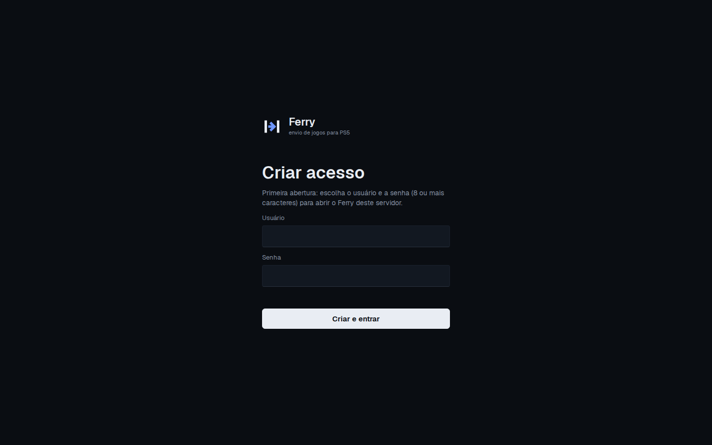
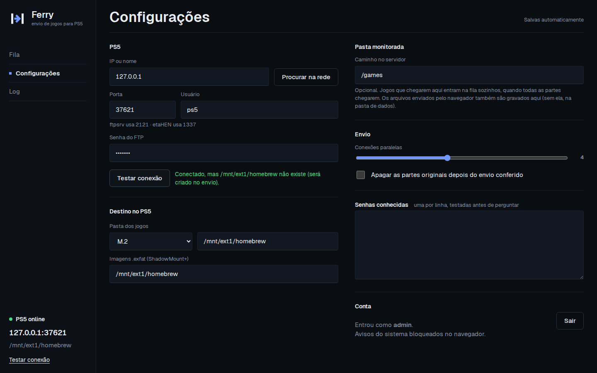
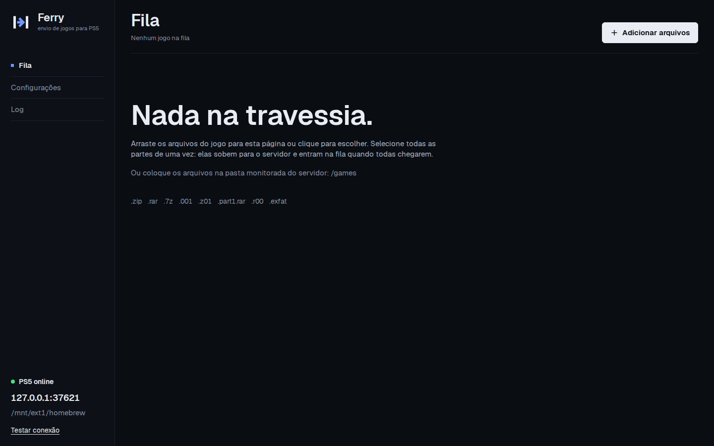
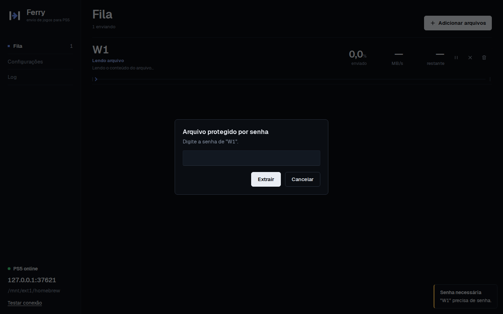
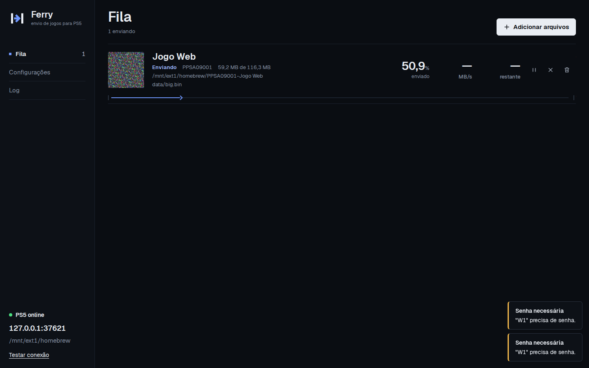
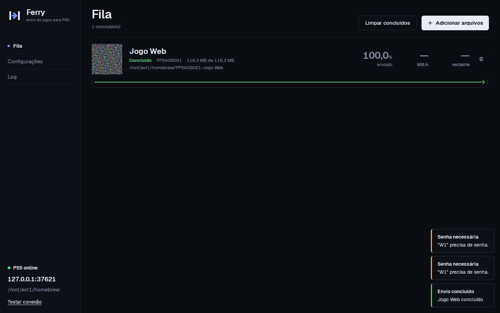
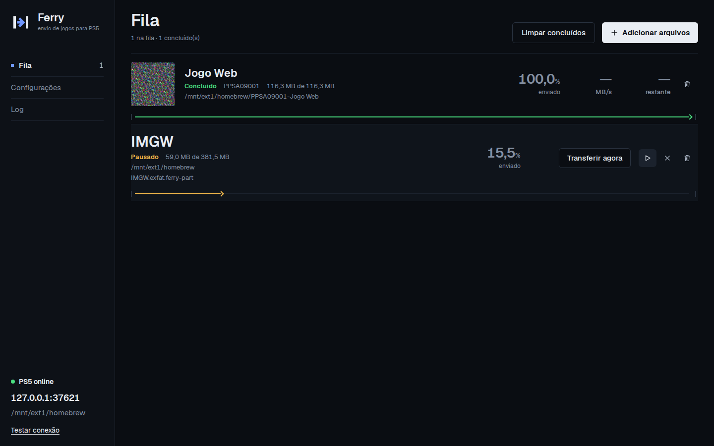
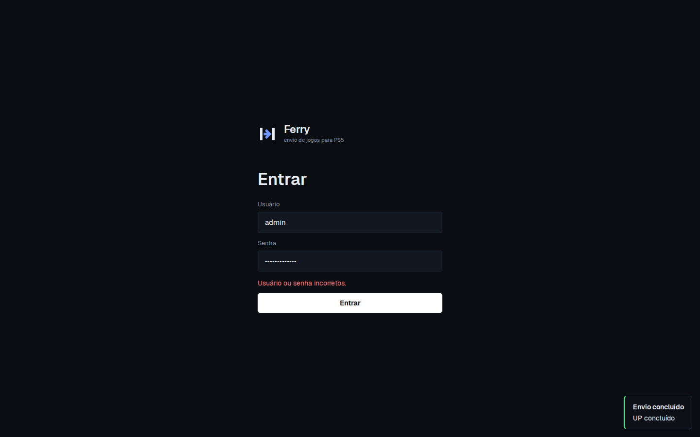
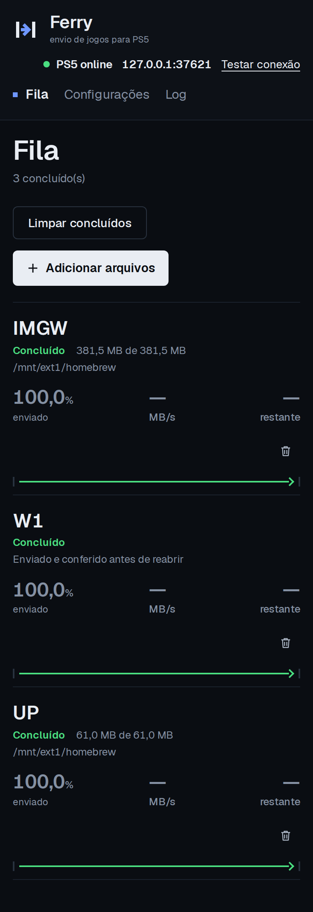

# Relatório E2E web — Ferry self-hosted

- Data: 2026-09-30 10:06:29 UTC
- Resultado geral: **PASSOU**  (68s)
- Imagem: `ferry:e2e` rodando com `--network host` e `--user 0:0`, volumes /data e /games; navegador Chromium (Playwright)
- PS5 falso: pyftpdlib imitando o ftpsrv novo (com APPE), 40 MB/s por conexão; arquivos de teste gerados com 7-Zip 23.01 (x64) : Copyright (c) 1999-2023 Igor Pavlov : 2023-06-20

| Verificação | Resultado |
|---|---|
| API sem login responde 401 | ✅ settings 401, events 401 |
| Primeira abertura cria o usuário | ✅ tela "Criar acesso", senha curta: "A senha precisa ter pelo menos 8 caracteres.", auth.json criado |
| Configurações salvam sozinhas e recusam o inválido | ✅ porta "abc" → "A porta é um número de 1 a 65535." (continuou 2121); host/porta/usuário/senha salvos; pasta monitorada = /games |
| Testar conexão | ✅ Conectado, mas /mnt/ext1/homebrew não existe (será criado no envio). |
| Upload pelo navegador → senha no navegador → envio ao PS5 | ✅ 8 volumes .7z enviados pela página; diálogo "Arquivo protegido por senha", 1ª senha errada → "Senha incorreta", 2ª certa; estado Verificado (/mnt/ext1/homebrew/PPSA09001-Jogo Web); 7/7 SHA-256 iguais; capa e PPSA09001; senha entrou nas senhas conhecidas=true; cartão durante o envio "PS5 online" |
| Pausar e retomar pela página | ✅ congelou em 15.5% por 1,5 s e retomou |
| Reiniciar o container no meio do envio | ✅ docker restart em 29.8% (146800640 bytes no PS5); voltou sozinho, continuou com APPE (2x), hash confere, sem .ferry-part; login continuou valendo=true; Jogo Web continuou Verificado ("Enviado e conferido antes de reabrir") sem reenviar nada |
| Upload continua de onde parou | ✅ 1º bloco (16 MB) pela API; bloco repetido → 409; parcial não entrou na fila=true; a página continuou do byte 16777216 (3 bloco(s)); arquivo no servidor e no PS5 com o mesmo hash |
| Sair e entrar de novo | ✅ depois de sair a API responde 401; senha errada → "Usuário ou senha incorretos."; certa → entrou |
| Celular (390 px) | ✅ largura da página 390px, sem rolagem lateral |
| Sem erro de JavaScript na página | ✅ nenhum |

## Capturas

Repetir: `docker build -t ferry:e2e . && cd e2e/web && npm ci && node web.mjs`. Requer Docker, Python com `pyftpdlib` e 7-Zip.
