# Relatório E2E web — Ferry self-hosted (en)

- Data: 2026-09-30 17:25:01 UTC
- Resultado geral: **PASSOU**  (85s)
- Servidor: DLL local .NET, dados isolados; Chromium (Playwright). Docker não exercitado nesta rodada.
- PS5 falso: pyftpdlib imitando o ftpsrv novo (com APPE), 40 MB/s por conexão; arquivos de teste gerados com 7-Zip 24.07 (x64) : Copyright (c) 1999-2024 Igor Pavlov : 2024-06-19

| Verificação | Resultado |
|---|---|
| Catálogo público pt-BR | ✅  |
| Catálogo público en | ✅  |
| Catálogos servidos têm mesmas chaves e parâmetros | ✅  |
| Automático pt-PT, en-US | ✅ pt-BR |
| Automático en-GB, pt-BR | ✅ en |
| Automático ja-JP, pt-BR | ✅ pt-BR |
| Automático ja-JP, fr-FR | ✅ en |
| Teste de webhook exige login | ✅  |
| DPI e solicitação exigem login | ✅  |
| API sem login responde 401 | ✅ settings 401, events 401 |
| Primeira abertura cria o usuário | ✅ tela "Create access", senha curta: "The password must have at least 8 characters.", auth.json criado |
| Idioma inválido não altera preferência | ✅  |
| Escolha explícita precede navegador | ✅  |
| Configurações salvam sozinhas e recusam o inválido | ✅ porta "abc" → "The port must be a number from 1 to 65535." (continuou 2121); host/porta/usuário/senha salvos; pasta monitorada = \\?\C:\Users\ADMINI~1\AppData\Local\Temp\ferry-web-e2e-en\games; GET atrasado 1,5 s não desfez o que foi digitado=true |
| Testar conexão | ✅ Connected, but /mnt/ext1/homebrew does not exist (it will be created during transfer). |
| Log já recebido muda de idioma sem perder sequência | ✅  |
| Testar aguarda a URL salva e funciona desligado | ✅  |
| API valida serviço e tipo do interruptor | ✅  |
| URL inválida preserva a anterior e não dispara teste | ✅  |
| Teste mostra falha HTTP | ✅  |
| Discord usa confirmação e desativa menções | ✅  |
| ntfy recebe texto UTF-8 no tópico | ✅  |
| Automático persiste e outro navegador não altera os avisos | ✅  |
| Idioma durante upload preserva campo editado | ✅  |
| Webhook de senha chega antes da resposta ao diálogo | ✅  |
| Idioma preserva diálogo e senha digitada | ✅  |
| Upload pelo navegador → senha no navegador → envio ao PS5 | ✅ 8 volumes .7z enviados pela página; diálogo "Password-protected archive", 1ª senha errada → "Senha incorreta", 2ª certa; estado Verificado (/mnt/ext1/homebrew/PPSA09001-Jogo Web); 7/7 SHA-256 iguais; capa e PPSA09001; senha entrou nas senhas conhecidas=true; cartão durante o envio "PS5 online" |
| Webhook de senha sem resposta não bloqueia diálogo nem FTP | ✅  |
| Webhook contém evento, jogo e idioma sem repetir senha incorreta | ✅  |
| Idioma preserva card pausado e progresso | ✅  |
| Idioma durante transferência mantém andamento | ✅  |
| Reinício interrompe uma transferência ainda incompleta | ✅  |
| Idioma persiste após reiniciar e recarregar | ✅  |
| Pausar e retomar pela página | ✅ congelou em 21.8% por 1,5 s e retomou |
| Reiniciar o servidor local no meio do envio | ✅ reinício da DLL local em 64.2% (337799624 bytes no PS5); voltou sozinho, continuou com APPE (2x após reabrir), hash confere, sem .ferry-part; login continuou valendo=true; Jogo Web continuou Verificado ("Sent and verified before reopening") sem reenviar nada |
| Webhook persiste ao reiniciar e não repete conclusão restaurada | ✅  |
| Upload continua de onde parou | ✅ 1º bloco (16 MB) pela API; bloco repetido → 409; parcial não entrou na fila=true; a página continuou do byte 16777216 (3 bloco(s)); arquivo no servidor e no PS5 com o mesmo hash |
| Adicionar de novo um jogo concluído | ✅ reenvio pela página começou do byte 0 (4 blocos, sem pular por ter o mesmo tamanho); o card voltou para a fila e parou em "Game already installed on the PS5 — the …" |
| Webhook de erro não exporta senha nem diagnósticos brutos | ✅  |
| Porta DPI inválida preserva configuração | ✅  |
| Teste DPI não instala | ✅  |
| Modo padrão apenas envia, zero solicitações DPI | ✅  |
| PKG publicado na raiz padrão etaHEN e íntegro | ✅  |
| PKG enviado mostra caminho completo e instalação manual | ✅  |
| PKG pronto não dispara completed nem installation_requested | ✅  |
| Ativar automático não reinstala PKG já preparado | ✅  |
| PKG web publicado antes do pedido, hash e origem preservados | ✅  |
| PKG mostra solicitação, sem afirmar instalação concluída | ✅  |
| Webhook de PKG é distinto de completed | ✅  |
| PKG compactado chega íntegro, sem sucesso em resposta perdida | ✅  |
| Reinício nunca repete pedidos PKG | ✅  |
| Reenvio confirmado não retransfere PKG | ✅  |
| Sair e entrar de novo | ✅ depois de sair a API responde 401; senha errada → "Incorrect username or password."; certa → entrou |
| Celular (390 px) | ✅ largura da página 390px, sem rolagem lateral |
| Sem navegador e com webhook HTTP 500 o FTP conclui | ✅  |
| Sem erro de JavaScript na página | ✅ nenhum |

## Capturas

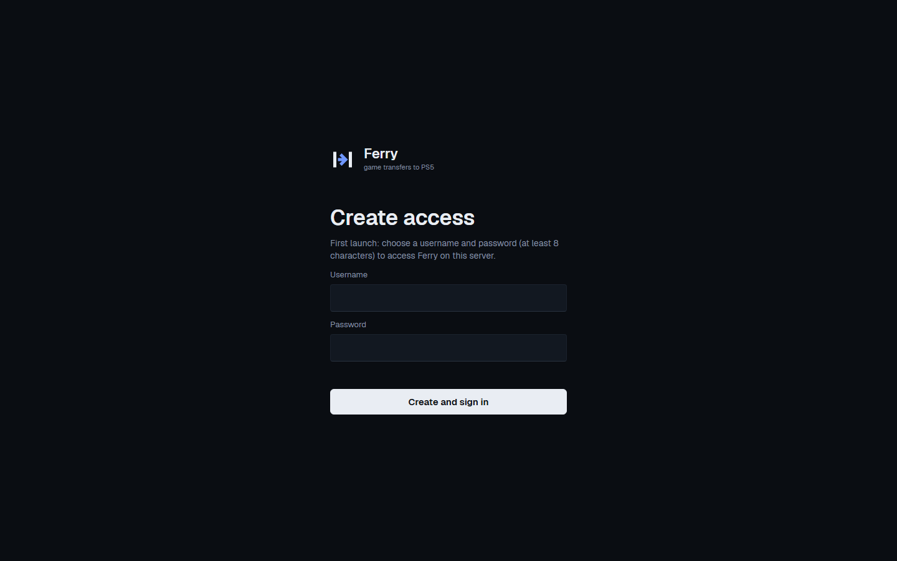
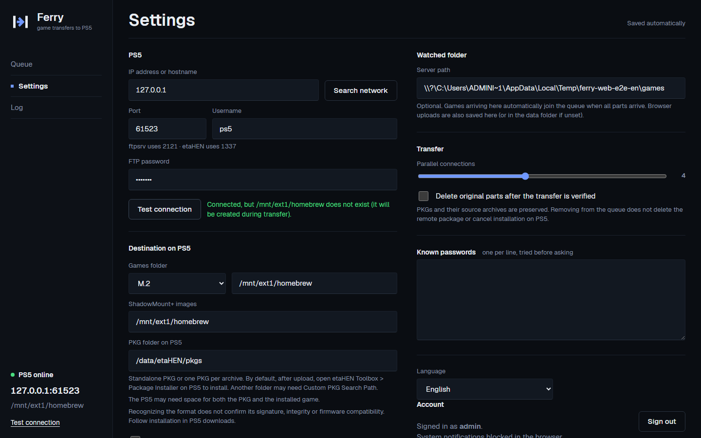
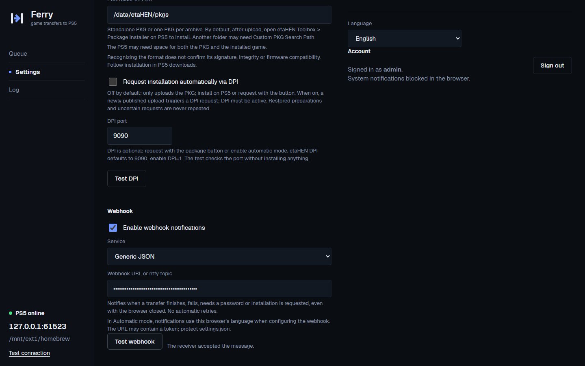
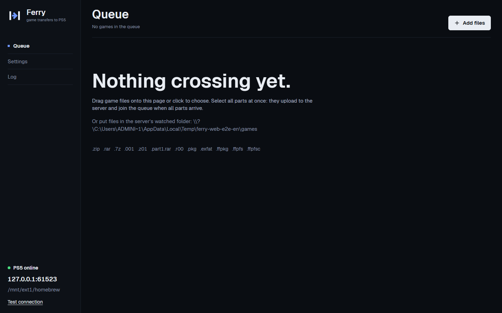
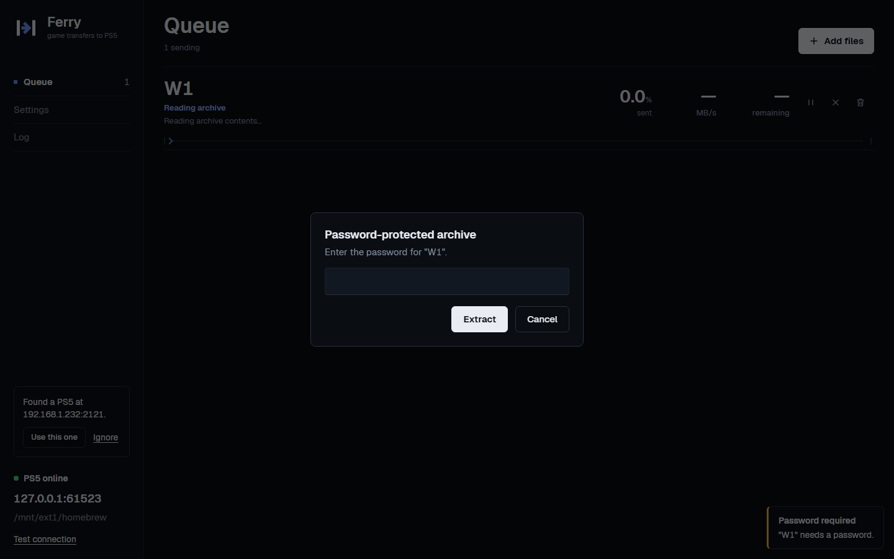
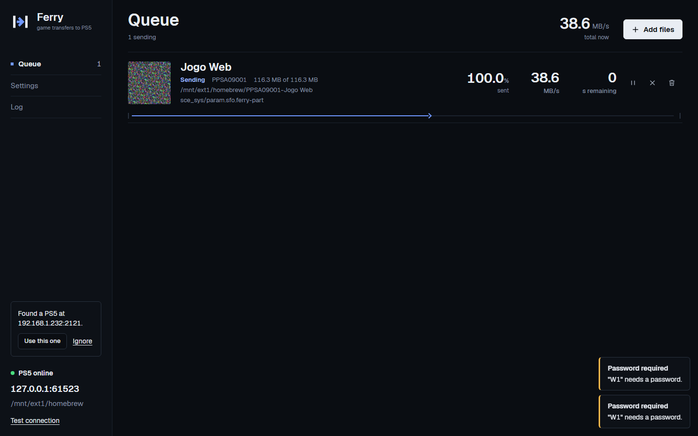
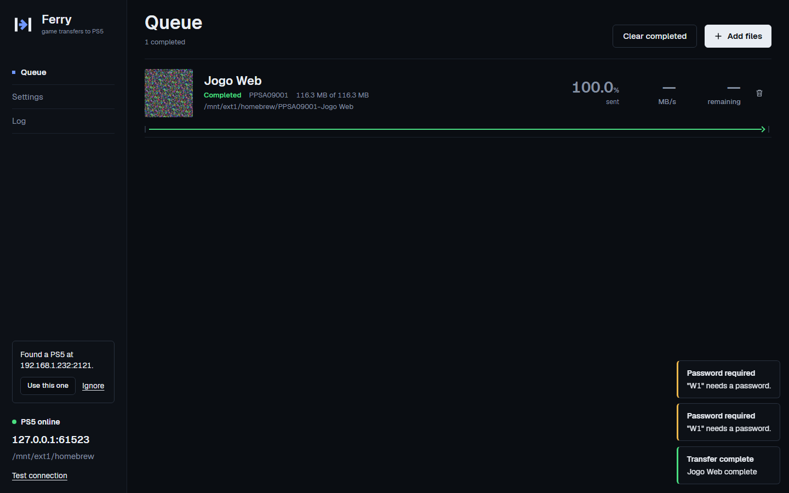
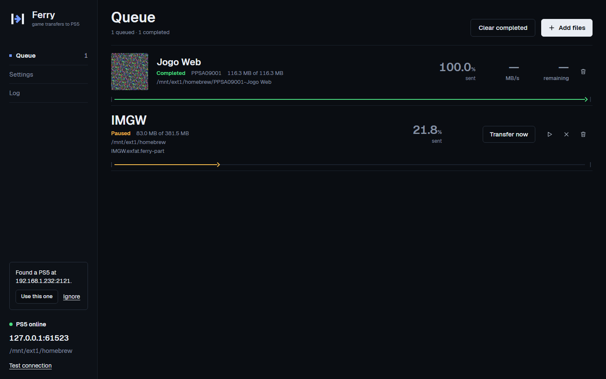
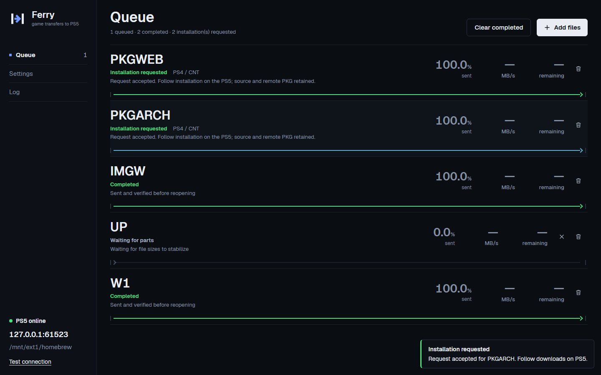
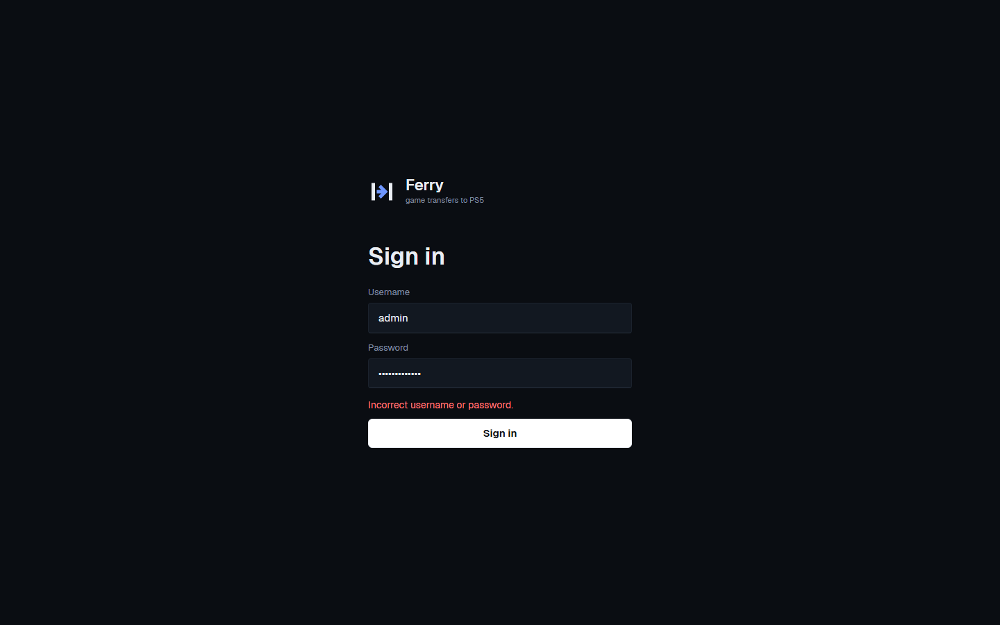
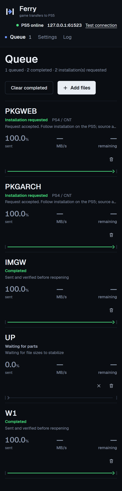

Repetir: `dotnet build web -c Release`; em `e2e/web`, `npm ci`, `npx playwright install chromium`; configure `FERRY_WEB_MODE=local` e execute `node web.mjs`. Requer .NET, Python com `pyftpdlib` e 7-Zip.
